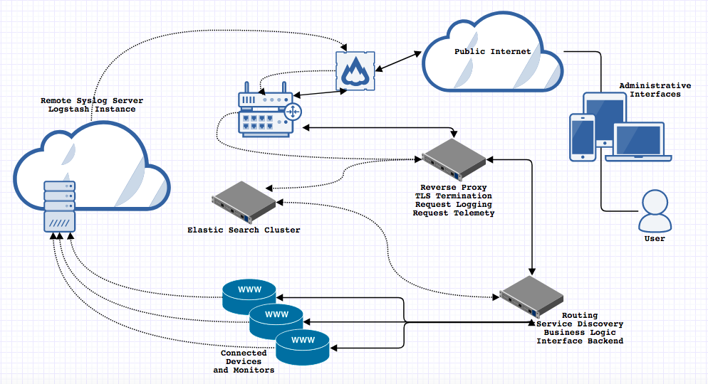

### IMPORTANT NEWS
```
   (*)
 ___|___
| _   _ |
||0| |0||
|   :   |
 |=====|
  |} {|

Nothing important to report as of Sat Jan 13 2018...
```

### Introduction
HomeBotty (play on [homebody](https://www.urbandictionary.com/define.php?term=homebody), 
get it?) is a collection of various home automation bits and bobs meant to make
life at home integrated, automated, and simply _better_. The hope is that with
a non-trivial amount of effort, this repository will become a central place from
which software (or software configuration) can be coordinated, distributed, and
built upon for personal (and possibly public) consumption.

The TL;DR  goals of this project is to deliver a POC that can do some simple
home automation tasks. Some examples of these tasks are, toggling lights or
outlets, monitor fuel consumption, locking or unlocking doors... you get the
idea. Accompanying these simple goals are a few tertiary objectives which
provide value to those who may not be as interested in the development of such
systems and are more inclined to relate to their ease of use or appearance.
Those goals include an inviting web based GUI, mobile integration and
communication, and most importantly a bot.

The (slack)Bot in homeBotty will grow organically over time and eventually become
the most shared (and modular) part of this repository. My hope is that by
integrating with a mechanism which people are familiar interacting with, they will
become more likely to use the tools behind the interface. This lowers the entry
barrier to home automation and opens up other development opportunities like
machine learning, artificial intelligence, and data analysis.

### Problem Statement
Computing is becoming cheaper. Devices are becoming cheaper. The declining cost
of home automation and the improved quality of life through connected devices
should not be a dependent upon a user relinquishing their personal information.
If the hardware is not the source by which a company profits, then what is it?
If the most valuable stream of revenue is vast amounts of data, how can the
consumer to which that data fundamentally belongs be protected? Atop that
protection which should be a non issue, if a user is open to sharing this
information should not they be able to participate in the revenue which it
generates?

- Cost
The cost of buying devices is cheap but comes at an alternative price of
relinquishing personal data.

- Privacy
Terms and conditions are likely not thoroughly read and include information
which consumers may generally not be agreeable to.

- Security
Is transmission of data encrypted? Is storage encrypted? What are some of the
technical details of maintaining the anonymity and security of user data.

- Ownership
Every company is profiting off of user data in _some_ way or another. More than
likely this is through selling anonymous usage to firms and/or more personalized
localized usage to develop directed marketing. Can this be avoided? Can this
gold mine be profit shared? Should it be?

- Personalization
How do these system learn about the user? Does the experience become more
personalized over time? Do people want Hal in their house? Does this matter?

### [Architecture](./docs/architecture)

The main goals in the design of this system are to isolate the nodes, represented
by the small web servers, to having a single ingress and a single egress.
Communication to the connected devices will sit behind firewall rules, router
rules, a reverse proxy, and the business logic in the device router. Their only
communication out will be in the form of logging to a centralized syslog server
which must also traverse the same entrance hurdles in pushing the metrics to
storage. 

### Getting Started
Should include a TL;DR here but have a directory in this repository which is more
explicitly meant for such things

### General Notes
This section is meant for collecting general notes which are quickly accessible
and most undoubtedly helpful. Links, rants, commands, help, etc.