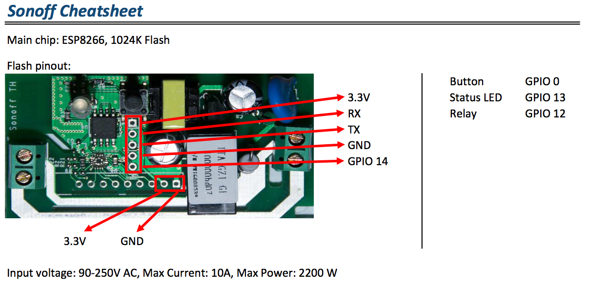

### Hardware
This document serves to outline the various pieces of hardware (microcontrollers
and otherwise) used through out the project. It should be noted that there is a
plethora of various breakout boards, but largely the ESP8266 chip is by far the
backbone of this endeavor.

### ESP8266
TL;DR a WiFi chip use in a vast majority of modern day electronics.

For the purposes of this project, as well as an earnest effort to expand my own
understanding and exploration of this chip, I've created a separate repository
[the ESP8266 repository](https://github.com/lowellmower/ESP8266), containing a
number of tools, diagrams, and basics of interacting with this chip (and others).

### Sonoff Wifi Smart Switch
TL;DR an ESP8266 with a basic relay. 

For the purposes of this project we must flash our own custom firmware on to this
chip. However, it should be noted that if one is willing to use the Sonoff servers
to connect and communicate with the ESP8266, including using their mobile app for
pairing and interfacing, the smart switch is ready "out of the box".

I likely would not have opted for these if not for the fact that 3 were given to
me as a gift. However, that being said, there are some positives and negatives
with regard to these switches which I will briefly cover.

PROS:
- Extremely cost effective (~$5US) versus buying parts individually
- You get a relay, an ESP8266, and closed circuit power in a single unit
- You do not have to solder the board together

CONS:
- Who knows what happens to the data going through their servers
- If you want to know more you can go to [http://sonoff.itead.cc](http://sonoff.itead.cc)
- Their fucking website doesn't have a fucking cert ^
- Cannot connect to flash new firmware without soldering headers
- No USB/TTL connector
- IEEE 108.11 b/g/n standard means only 2.4Ghz wifi support
- No support for grounded cables to run through the box

As noted in the `CONS` section above, the breakout board must be soldered to
support connecting a serial cable and flashing new firmware. [I've made a small
write up]() on how to solder the pin headers using a USB-TTL to UART converter
which you can buy for ~$2US. For ease of reference and posterity, I've included
an image below referencing the headers and `GPIO` pins.

[This will be a link to setup instructions for flashing firmware]()

[This will be a link to the latest binary for the chip]()
